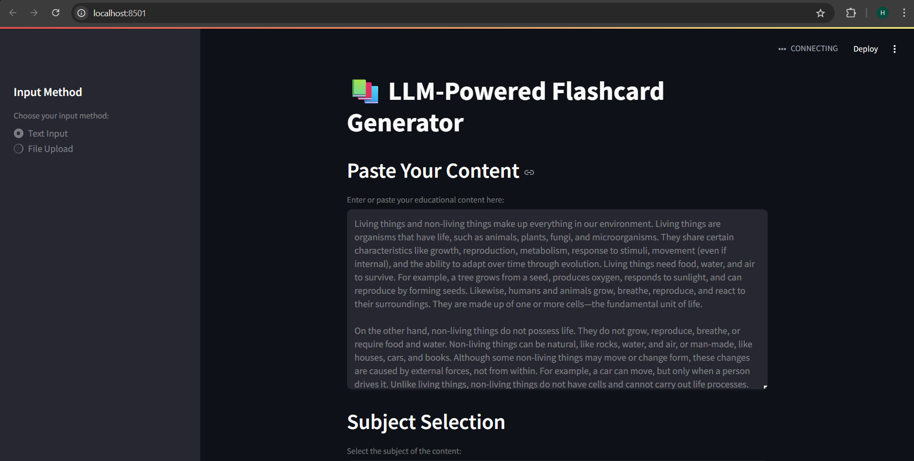

# LLM-Powered Flashcard Generator

A lightweight tool that converts educational content into question-answer flashcards using the `t5-small` language model from Hugging Face.

## Features

- Converts textbook excerpts/lecture notes into flashcards
- Supports text input via:
  - File upload (.txt)
  - Direct text paste
- Generates 10-15 flashcards per submission
- Basic UI with Streamlit
- Export flashcards to CSV format

## Technical Stack

- Python 3.8+
- Hugging Face Transformers (`t5-small` model)
- Streamlit (for web interface)
- Pandas (for data handling)

## Installation

1. Clone the repository:
```bash
https://github.com/him77anshu/LLM-flashcard_Generator
```
2. Create and activate a virtual environment:
```bash
python -m venv venv
source venv/bin/activate
```
3.Install dependencies:
```bash
pip install -r requirements.txt
```
## Usage
1.Run the Streamlit application:
```bash
streamlit run app.py
```
2.In the web interface:
 -Select input method (file upload or text paste)
 -Provide your educational content
 -Click "Generate Flashcards"
 -Review and export the generated flashcards

 ## Sample Input/Output
    

## Project Structure 📂

```bash
flashcard-generator/
│
├── app.py                  # 🚀 Main Streamlit application
├── flashcard_generator.py   # 🤖 Core AI processing logic
├── requirements.txt         # 📦 Dependency specifications
├── README.md               # 📖 Project documentation
│
├── samples/                # 🧪 Example files
│   ├── sample_input.txt    # 📝 Raw educational content
│   └── sample_output.csv   # 🃏 Generated flashcards
│

```

## Limitations ⚠️

- **Language Support**  
  Currently optimized only for English text inputs  
  *Non-English content may produce unreliable results*

- **Content Requirements**  
  Best results with:  
  ✅ Clear, factual educational content  
  ✅ Well-structured textbook material  
  ❌ Poor performance with:  
  &nbsp;&nbsp;- Ambiguous passages  
  &nbsp;&nbsp;- Opinion-based content  
  &nbsp;&nbsp;- Highly technical jargon  

- **Model Constraints**  
  Using `t5-small` means:  
  🔸 Less nuanced understanding than larger LLMs  
  🔸 512 token context window limit  
  🔸 Occasional factual inconsistencies  

## Future Enhancements 🚀  

| Priority | Feature                  | Technical Approach                          |
|----------|--------------------------|---------------------------------------------|
| High     | Anki/Quizlet export      | `genanki` library integration              |
| Medium   | Difficulty classification | Bloom's Taxonomy analysis                  |
| High     | Multi-language support   | NLLB translation pipeline                  |
| Medium   | Topic detection          | BERT embeddings + clustering               |
